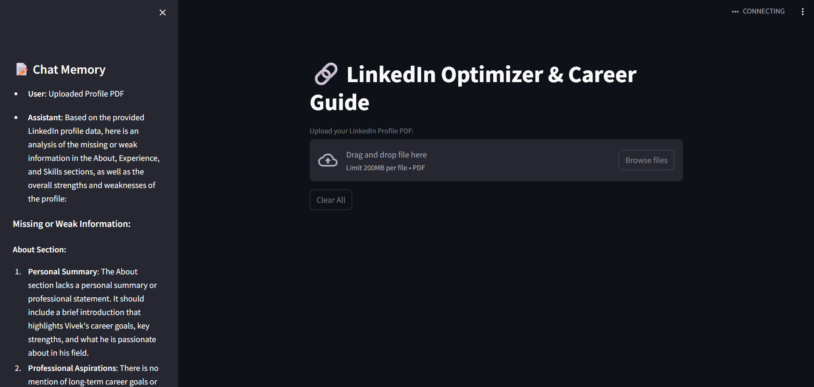

# 🔗 LinkedIn GenAI Chat Assistant

This Streamlit app helps you optimize your LinkedIn profile with advanced AI agents.  
Upload your LinkedIn profile PDF, analyze it, get job fit insights, enhance your profile sections, and receive career counseling with skill gap recommendations.

---

## 🚀 Features
✅ **Profile Analysis** — Automatically evaluates your profile (About, Experience, Skills) from a PDF and highlights gaps or inconsistencies.  
✅ **Job Fit Analysis** — Compares your profile with an industry-standard job description for your target role, generates a match analysis, and suggests improvements.  
✅ **Content Enhancement** — Rewrites profile sections to align with best practices for your chosen role.  
✅ **Career Counseling** — Identifies missing skills needed for the target role and recommends online courses or learning paths.  
✅ **Chat Memory** — Sidebar keeps a session log of your interactions.

---

## 🖥️ Demo Screenshot


---

## 📂 Project Structure

📂 genai_linkedin/
├── agents/
│   ├── profile_agent.py
│   ├── jobfit_agent.py
│   ├── content_agent.py
│   └── counseling_agent.py
├── memory/
│   ├── memory_manager.py
│   └── ...
├── app.py
├── requirements.txt
├── README.md
└── .env.example

---

## 🛠️ Setup & Run Locally

1️⃣ Clone the repo:

```bash
git clone https://github.com/yourusername/genai_linkedin.git
cd genai_linkedin

2️⃣ Create a virtual environment & install dependencies:

python -m venv venv
venv\Scripts\activate          # Windows
# or source venv/bin/activate  # macOS/Linux

pip install -r requirements.txt

3️⃣ Add your OpenAI API key in a .env file:

OPENAI_API_KEY=sk-xxxxxxxxxxxxxxxxxxxxxxxxxxxxxxxx

4️⃣ Run the app:

streamlit run app.py

Then open http://localhost:8501 in your browser.

📝 Usage
✅ Upload your LinkedIn profile exported as a PDF.
✅ Enter your target job role (e.g., "Data Analyst").
✅ View automatic profile analysis results.
✅ Get a personalized job fit analysis comparing your profile to a standard JD.
✅ Paste profile sections you want improved and generate AI-enhanced versions.
✅ Get career counseling with missing skill identification and course recommendations.
✅ Use the sidebar memory to track your session history.
✅ Clear all data anytime with the Clear All button.

🔐 Environment Variables

OPENAI_API_KEY — Required for language model calls.
Example .env file:
# .env.example
OPENAI_API_KEY=sk-your-openai-api-key

📜 License

MIT License © [Vivek Shivam Saharia]

✨ Acknowledgments

Built with Streamlit and LangChain.
Inspired by real-world needs for effective LinkedIn profile optimization.

🙋 Need Help?
Feel free to open an issue on the repo or reach out.

---

✅ **You’re ready!**  
This includes the README + a `.env.example` section, perfectly formatted for copy-paste.  
Would you like a matching sample `requirements.txt` to paste in too?
